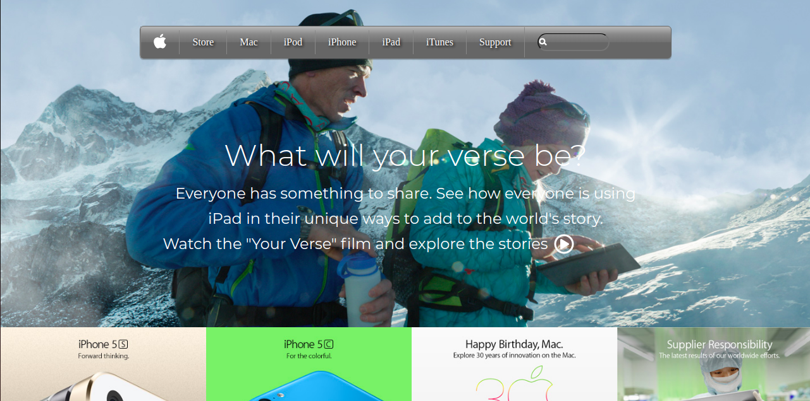

# Project Name

> This is a clone of the Apple Homepage.

Additional description about the project and its features.

## Built With

- HTML5
- CSS3

## Live Demo

[Live Demo Link](https://raw.githack.com/KelynPNjeri/Apple-Homepage-Clone/develop/index.html)

## Getting Started
To get a local copy up and running follow these simple example steps.

### Prerequisites
- Git.
- A web browser.

### Setup
- Clone/Download the repository.
- Open the downloaded form of the project.
- Run `index.html` on your browser.

## Authors

👤 **Kelyn Paul Njeri**

- Github: [@KelynPNjeri](https://github.com/KelynPNjeri)
- Twitter: [@Kelyn Njeri](https://twitter.com/KelynNjeri)
- Linkedin: [Kelyn Paul](https://linkedin.com/kelynpaul)

## 🤝 Contributing

Contributions, issues and feature requests are welcome!

Feel free to check the [issues page](issues/).

## Show your support

Give a ⭐️ if you like this project!

## Acknowledgments

- Mariana Campos

## 📝 License

This project is [MIT](lic.url) licensed.